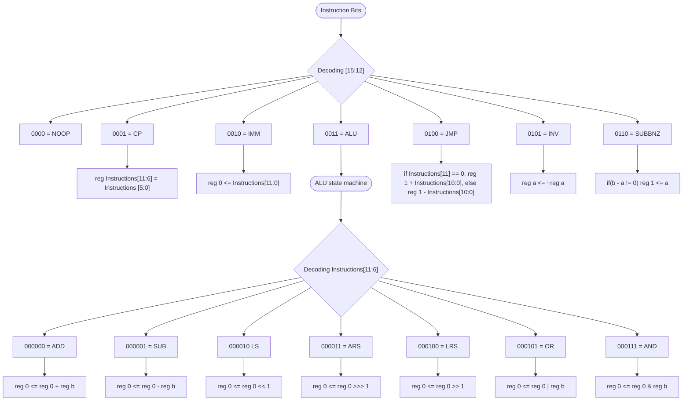

# Teague Processing Unit

This is the official plan for the Teague Processing Unit (TPU).

The goal of this project is to create a CPU and OS on a PYNQ FPGA dev board with minimal logic usage.

## The goals:

- [ ] Create a basic turing complete CPU driven by TDD
- [ ] Optimise this CPU for logic usage
- [ ] Create an OS that has the ability to drive:
  - [ ] An external HDMI display (via the board's built in HDMI socket)
  - [ ] A USB Keyboard via a rudimentary USB stack
  - [ ] Audio via the board's two 3.5 mm jacks

## The CPU:

- Will use 16 bit buses, with 4 bit opcodes.
- Will use 16 bit registers.
- Will use a Von Neumann Architecture.

This means:

- 16 instructions max
- 60 registers per bank (with 4 global special registers)

  - Register address 000000 is reserved for the ALU accumulator
  - Register address 000001 is reserved for the program counter
  - Register address 000010 is reserved for bank select
  - Register address 000011 is reserved for the CPU Flags

- If we plan on incorporating HDMI output then we will need to reserve 18,000 registers for the display buffer, or ~282 banks.

## Instructions:

| Instruction      | TASM Name | Description                                                         |
| ---------------- | --------- | ------------------------------------------------------------------- |
| 0000XXXXXXXXXXXX | NOOP      | No operation                                                        |
| 0001AAAAAABBBBBB | CP        | Copy contents of reg a to reg b                                     |
| 0010AAAAAAAAAAAA | IMM       | Set an immediate value to the accumulator                           |
| 0011AAAAAABBBBBB | ALU       | Trigger the ALU state machine with command A from reg b (see below) |
| 0100AAAAAAAAAAAA | JMP       | Change program counter by a signed 12 bit value                     |
| 0101XXXXXXAAAAAA | INV       | Invert all bits of reg a                                            |
| 0110AAAAAABBBBBB | SUBBNZ    | Subtract B from A, set PC to value in A if result != 0              |
| 0111             | RES       | Reserved for expansion                                              |
| 1000             | RES       | Reserved for expansion                                              |
| 1001             | RES       | Reserved for expansion                                              |
| 1010             | RES       | Reserved for expansion                                              |
| 1011             | RES       | Reserved for expansion                                              |
| 1100             | RES       | Reserved for expansion                                              |
| 1101             | RES       | Reserved for expansion                                              |
| 1110             | RES       | Reserved for expansion                                              |
| 1111             | RES       | Reserved for expansion                                              |

## ALU State Machine

| Reg A   | Description                        |
| ------- | ---------------------------------- |
| 000000  | Add reg b to accumulator           |
| 000001  | Subtract reg b from accumulator    |
| 000010  | Accumulator left shift             |
| 000011  | Accumulator arithmetic right shift |
| 000100  | Accumulator logical right shift    |
| 000101  | Logical OR reg b with accumulator  |
| 000110  | Logical AND reg b with accumulator |
| 001000  | Reserved                           |
| 001001  | Reserved                           |
| 001010  | Reserved                           |
| ...     | Reserved                           |
| 1111111 | Reserved                           |

## CPU Instruction Flow

